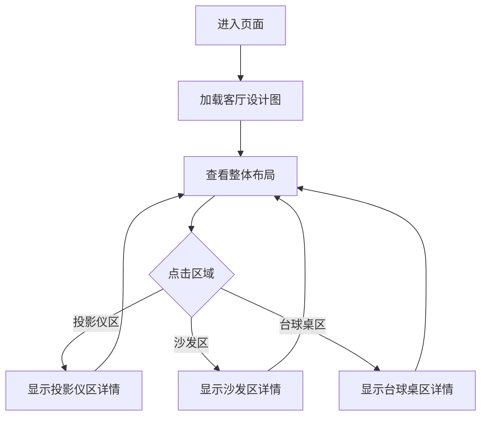

## 1. Product Overview

交互式客厅设计图展示平台，为用户提供 10m x 6m 客厅的三维布局设计，包含投影仪投屏区域、沙发区和台球桌区域，支持实时查看和交互。

- 核心目标：可视化展示客厅空间布局，帮助用户理解不同区域的规划
- 目标用户：需要设计客厅空间的业主、室内设计师

## 2. Core Features

### 2.1 User Roles
| Role | Registration Method | Core Permissions |
|------|---------------------|------------------|
| Normal User | 无需注册 | 查看设计图、交互浏览 |

### 2.2 Feature Module
1. **客厅设计图页面**: 主视图，展示完整客厅布局
2. **区域详情面板**: 显示各功能区域的详细信息

### 2.3 Page Details
| Page Name | Module Name | Feature description |
|-----------|-------------|---------------------|
| 客厅设计图 | 主视图 | 10m x 6m 客厅俯视图，展示投影仪、沙发、台球桌位置 |
| 客厅设计图 | 区域标注 | 各功能区域的文字标注和尺寸说明 |
| 客厅设计图 | 交互面板 | 点击区域显示详细信息 |

## 3. Core Process

用户访问页面 → 查看客厅设计图 → 点击各区域 → 查看区域详情

## 4. User Interface Design

### 4.1 Design Style
- 主色调：现代简约风格，深灰色背景配暖木色调
- 辅助色：金色点缀用于强调区域边界
- 字体：使用衬线字体展现品质感
- 布局：俯视图为主，配以详细标注

### 4.2 Page Design Overview
| Page Name | Module Name | UI Elements |
|-----------|-------------|-------------|
| 客厅设计图 | 主视图 | 10m x 6m 矩形区域，网格背景，各功能区彩色块 |
| 客厅设计图 | 区域标注 | 投影仪幕布(蓝色)、沙发区(米色)、台球桌(绿色) |
| 客厅设计图 | 交互面板 | 浮动信息卡片，显示区域尺寸和用途 |

### 4.3 Responsiveness
- 桌面端：完整展示设计图和详细标注
- 移动端：简化布局，支持手势缩放

### 4.4 设计参数
- 客厅尺寸：长 10m x 宽 6m
- 台球桌标准尺寸：约 2.8m x 1.5m
- 沙发区：约 4m x 2.5m
- 投影仪区域：墙面作为投影幕布