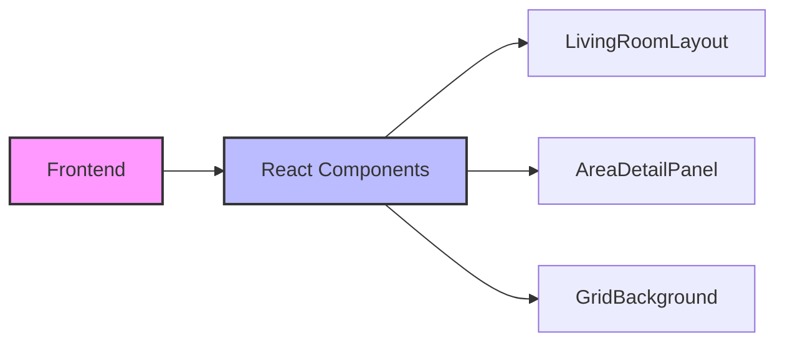

## 1. Architecture Design



## 2. Technology Description

- Frontend: React@18 + tailwindcss@3 + vite
- Initialization Tool: vite-init
- Backend: None
- Database: None

## 3. Route Definitions

| Route | Purpose |
|-------|---------|
| / | 客厅设计图主页 |

## 4. API Definitions

无后端 API 需求

## 5. Component Structure

```
src/
├── components/
│   ├── LivingRoomLayout.tsx    # 客厅布局主组件
│   ├── AreaDetailPanel.tsx     # 区域详情面板
│   ├── GridBackground.tsx      # 网格背景组件
│   └── AreaMarker.tsx          # 区域标记组件
├── pages/
│   └── Home.tsx                # 首页
├── types/
│   └── index.ts                # 类型定义
├── App.tsx
├── main.tsx
└── index.css
```

## 6. Data Model

### 6.1 区域数据结构

```typescript
interface Area {
  id: string;
  name: string;
  x: number;          // 左上角X坐标(米)
  y: number;          // 左上角Y坐标(米)
  width: number;      // 宽度(米)
  height: number;     // 高度(米)
  color: string;      // 区域颜色
  description: string; // 区域描述
  icon: string;       // 图标名称
}
```

### 6.2 区域配置数据

| 区域名称 | X | Y | 宽度 | 高度 | 颜色 | 用途 |
|----------|---|---|------|------|------|------|
| 投影仪区 | 0 | 1.5 | 10 | 3 | #3B82F6 | 投影幕布墙面 |
| 沙发区 | 5 | 1.5 | 4 | 2.5 | #F5F5DC | 三人沙发+茶几 |
| 台球桌区 | 0.5 | 0.5 | 3.2 | 1.8 | #228B22 | 标准台球桌 |